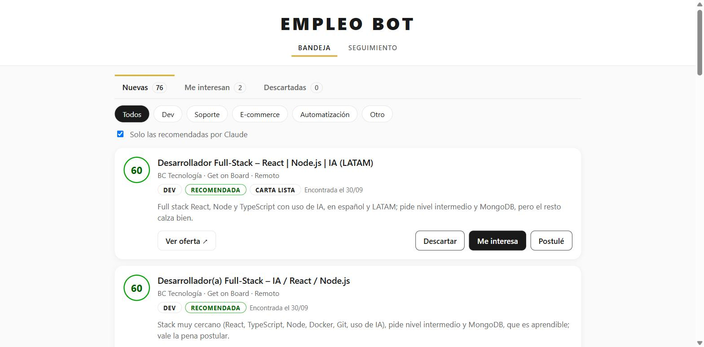
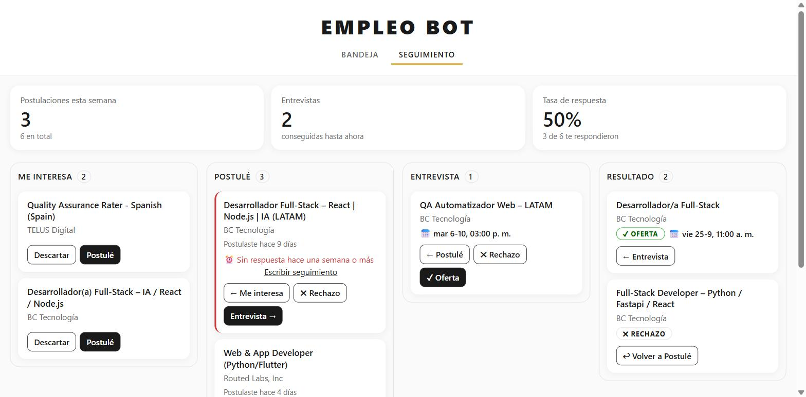

# Empleo Bot

Asistente personal de búsqueda de empleo. Cada 12 horas busca ofertas remotas en varios portales, **Claude las evalúa contra mi perfil**, y una app web me deja decidir, escribir la carta de presentación de cada una y seguir las postulaciones hasta el resultado.

Lo construí para mi propia búsqueda de trabajo. Corre en mi PC y usa Claude a través de **Claude Code con la suscripción** (`claude -p`), así que no hay costos de API.

| Bandeja: ofertas evaluadas por Claude | Seguimiento: postulaciones en marcha |
|---|---|
|  |  |

## Qué hace

1. **Busca** (sola cada 12 horas mientras la app está abierta, o con el botón "Buscar ahora"): consulta 6 portales con API o RSS pública (Get on Board, RemoteOK, Remotive, Himalayas, Working Nomads y We Work Remotely) y lee de Gmail las alertas de empleo de LinkedIn.
2. **Filtra sin IA**: descarta con reglas los puestos senior, los que piden inglés avanzado y las ofertas repetidas. De ~250 ofertas quedan ~75, y Claude solo ve esas.
3. **Evalúa con Claude**, en lotes de 20: le pone a cada oferta un puntaje de 0 a 100, el tipo de puesto, si conviene postular, el motivo y si tiene señales de estafa.
4. **Bandeja**: decido cuáles me interesan y cuáles descarto.
5. **Carta de presentación**: Claude la escribe con mi perfil y lo que pide la oferta, sin inventar experiencia. La edito y la copio.
6. **Seguimiento**: un tablero Me interesa → Postulé → Entrevista → Resultado, con la fecha de cada entrevista, un resumen (postulaciones de la semana y tasa de respuesta) y un **recordatorio a los 7 días sin respuesta**, con el mensaje de seguimiento ya escrito.
7. **Seguimiento automático por Gmail**: cuando LinkedIn confirma que se envió una solicitud, la oferta pasa sola a "Postulé" (si no estaba, se crea). Cuando escribe una empresa a la que me postulé, Claude lee ese correo, lo clasifica (entrevista, rechazo, oferta u otro), mueve la tarjeta y deja una nota con el resumen. Corre mientras la app está abierta, cada 10 minutos (también hay un botón "Revisar Gmail ahora").
8. **Archivo y limpieza**: lo cerrado pasa al Archivo a los 7 días y se borra a los 30; las ofertas nuevas que nunca toqué se borran a los 30. De lo borrado queda solo la url y cómo terminó, así no se vuelve a evaluar y el historial no se pierde.

## Cómo funciona

```
 busqueda/buscar.js (la API lo corre cada 12 h o con "Buscar ahora")
   │  6 portales + alertas de Gmail ──► Normalizar + prefiltro (0 tokens) ──► data/entrada.json
   ▼
 evaluar.js ──► claude -p (lotes de 20) ──► SQLite (data/empleo.db)
                                               ▲
 React (web/) ◄──► API Express (server/) ──────┘
                        └──► claude -p  (cartas y mensajes de seguimiento)
```

| Parte | Tecnología |
|---|---|
| Búsqueda programada | Node.js (`busqueda/buscar.js`, lo dispara la API con `setInterval`) |
| Correo | IMAP de Gmail con `imapflow` + `mailparser` (solo lectura) |
| IA | Claude vía Claude Code (`claude -p`, sin herramientas ni sesión guardada) |
| API | Node.js 24 + Express 5 + `node:sqlite` (SQLite sin dependencias externas) |
| Frontend | React 19 + TypeScript + Vite + TanStack Query |
| Tests | `node:test` (API) y Vitest + Testing Library (frontend) |

## Decisiones de diseño

- **Filtro barato antes que IA cara.** Las reglas (regex) sacan lo que seguro no sirve, y Claude evalúa solo el resto. Se manda en lotes de 20 y no en 76 llamadas, y las ofertas ya vistas no se vuelven a evaluar.
- **Una decisión es más estable que un número.** El puntaje de Claude varía entre corridas, así que además le pido un `postular: true/false`. La Bandeja usa esa decisión.
- **Honestidad en las cartas.** El prompt prohíbe inventar experiencia y exagerar el nivel de inglés: lo que falta se nombra como algo en aprendizaje.
- **Inyección de dependencias para testear sin gastar.** El router recibe el manager de datos y los "escritores" de texto. En los tests se usan una base en memoria y un Claude de mentira.
- **Una sola forma de guardar.** `evaluar.js` (el bot) y la API usan el mismo `OfertasManager`. Si una oferta ya existe (misma url), no se pisa: se conservan su estado, sus notas y su carta.
- **Migraciones sin perder datos.** Las columnas nuevas se agregan con `ALTER TABLE` al arrancar, solo si faltan.
- **Cambios optimistas en la UI.** La tarjeta cambia de columna al instante y vuelve atrás si la API falla.
- **Accesibilidad.** Colores con contraste AA, el estado nunca se comunica solo con color, y el panel de detalle se navega con teclado (foco y Escape).
- **Alertas por correo, nunca scraping.** LinkedIn prohíbe el scraping, así que se leen sus alertas de empleo por IMAP. El buzón se abre en modo solo lectura (no se marca nada como leído) y de cada link se guarda solo el id de la oferta: el link del correo trae tokens de inicio de sesión.
- **El correo decide solo cuando es seguro.** La confirmación de LinkedIn mueve la tarjeta sin IA. Las respuestas de las empresas las clasifica Claude, pero solo se avanza (o se cierra con un rechazo): nunca retrocede, cada correo se procesa una sola vez y, si Claude falla, se reintenta en la próxima revisión, hasta 3 veces (después se deja, para no gastar en un correo que siempre falla). Solo se bajan completos los correos que nombran a una empresa en proceso.
- **Borrar sin olvidar.** Una tabla mínima (`ofertas_borradas`) guarda la url y el estado final de lo borrado: la base no crece sin límite y el bot no vuelve a mostrar lo que ya vi.
- **Cada fuente por su lado.** Los portales se consultan a la vez y uno caído (o que no responde en 30 segundos) no frena a los demás: queda como aviso en la pantalla.
- **Privacidad.** Mis datos (`data/`, `perfil.md`, `.env`) nunca entran al repo. El perfil de ejemplo está en `perfil.example.md`.

## Cómo empezó: de n8n a código

La primera versión fue un flujo de **n8n** (`docs/n8n-version-inicial.json`): portales en paralelo, prefiltro en un nodo de código, Claude por un nodo Execute Command y un reloj diario. Armarlo en n8n sirvió para entender el flujo de datos paso a paso y probar la idea rápido.

Cuando el proyecto creció (base de datos propia, app web, seguimiento por Gmail, tests), lo pasé a código para no depender de n8n:

- **Un programa menos abierto.** La API ya está corriendo; ella misma dispara la búsqueda cada 12 horas o con un botón, también desde el celular.
- **Una sola versión de la lógica**, con tests y en git. Un flujo de n8n es un JSON grande, difícil de revisar en un commit.
- **Más robusto.** En el flujo, un portal caído cortaba toda la búsqueda; en código, cada fuente va por su lado, con tiempo máximo de espera.

El flujo queda como registro de esa primera versión y **ya no se mantiene**.

## Cómo correrlo

Requisitos: Node.js 24+ y [Claude Code](https://claude.com/claude-code) con sesión iniciada.

```bash
# 1. Perfil: copiar el ejemplo y completarlo con los datos propios
cp perfil.example.md perfil.md

# 2. API (sirve también la app compilada) en http://localhost:3001
cd server && npm install && npm run dev

# 3. App web (solo la primera vez o después de cambios)
cd web && npm install && npm run build
```

**Buscar a mano:** `npm run buscar` en la raíz (baja los portales, evalúa con Claude e imprime el resumen). Con la API abierta no hace falta: busca sola cada 12 horas.

**Alertas de Gmail (opcional):** `npm install` en la raíz y crear `.env` con `GMAIL_USUARIO` y `GMAIL_CLAVE_APP` (una [contraseña de aplicación](https://myaccount.google.com/apppasswords) de Google, que requiere la verificación en 2 pasos). Sin `.env`, la búsqueda sigue funcionando sin las alertas. Prueba: `node busqueda/leer-alertas.js 7`.

## Tests

```bash
npm test                # búsqueda, alertas y seguimiento por Gmail (correos inventados y un Claude de mentira)
cd server && npm test   # API, manager, migraciones y escritores de texto
cd web && npm test      # filtros, tablero, tarjetas y panel de detalle
```

## Autor

Deiber Rodríguez · [LinkedIn](https://linkedin.com/in/deiber-rodriguez-4b4872383) · [GitHub](https://github.com/deiberiganz-cloud)
